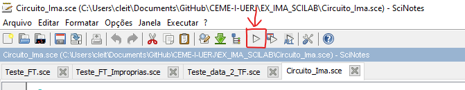
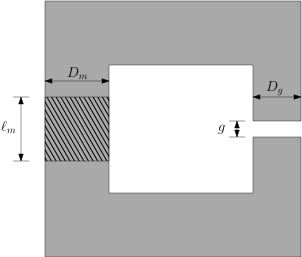
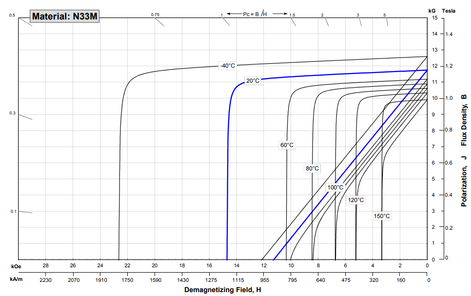
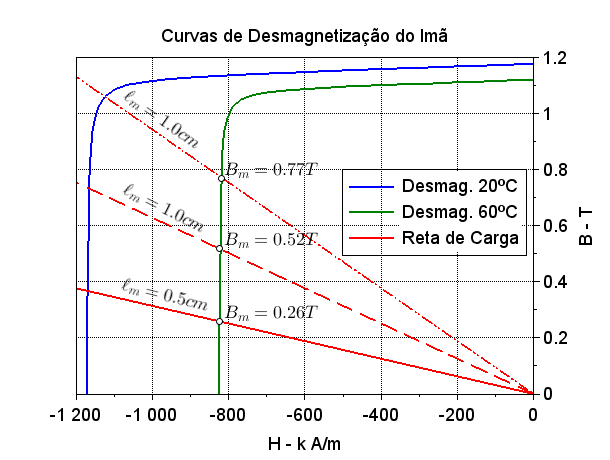

# Resolvendo circuitos magnéticos com Imãs Permanentes no SciLab

Repositorio com o código escrito durante a solução de um circuito magnético com imã permanente.

- [Resolvendo circuitos magnéticos com Imãs Permanentes no SciLab](#resolvendo-circuitos-magnéticos-com-imãs-permanentes-no-scilab)
  - [Recursos necessários](#recursos-necessários)
  - [Circuito magnético](#circuito-magnético)
  - [Resultados](#resultados)

## Recursos necessários

O script desta pasta, <code>Circuito_Ima.sce</code>, foi desenvolvido  com [SciLab](https://www.scilab.org/)  versão <code>6.1.0</code>. Quando abrir o script com o SciLab, a janela do SciNotes aparecerá. Para executar o programa, basta clicar em executar: 

 
    

## Circuito magnético

A figura seguinte mostra o circuito magnético que foi analisado. Na sequência é apresentando o conjunto de curvas de desmagnetização do imã. Os dados considerados estão no script <code>Circuito_Ima.sce</code>. 

 
    

 
    

## Resultados

Usando a metodologia estudada em aula, foi possível obter a seguinte reta de carga para o circuito: 

O gráfico seguinte, obtido no SciLab, apresenta duas curvas de desmagnetização (uma para cada temperatura) e três retas de carga (para diferentes comprimentos de imã). Observe que operando em 60ºC, o Imã produzirá diferentes valores de densidade de fluxo magnético dependendo do seu comprimento.

 
    

