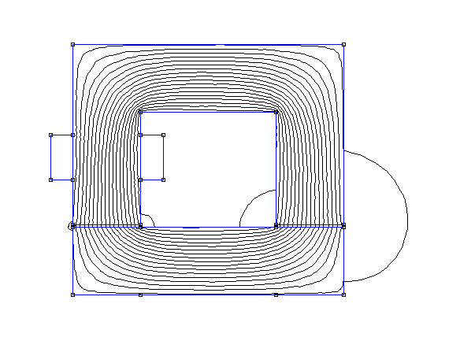

# Simulações de Circuitos Magnéticos Utilizando o Software FEMM
 
Para esta parte das aulas de laboratório utilizaremos o software [FEMM](http://www.femm.info/wiki/HomePage) desenvolvido pelo pesquisador [David Meeker](https://scholar.google.com/citations?user=ExvMNWoAAAAJ&hl=en). O software permite a simulação de circuitos magnéticos (entre outras aplicações) utilizando o [Método dos Elementos Finitos](https://pt.wikipedia.org/wiki/M%C3%A9todo_dos_elementos_finitos), sem que o usuário precise se preocupar com implementações computacionais relacionadas a solução de sistemas de equações diferenciais.
 
## Breve tutorial do FEMM
 
Vou mostrar aqui um passo a passo de como preparar e realizar a simulação de um circuito magnético. Mais detalhes podem ser encontrados neste tutorial [aqui](https://www.youtube.com/watch?v=5m0eEwUBxfs). 
 
> **Definir o problema**
* Basicamente ter em mãos os dados do circuito que você deseja simular. Para este tutorial vou utilizar o circuito da figura a seguir.
  

  
  

  
     
> **Criar um arquivo no FEMM**    
* Ao clicar em <code>File -> New</code> aparecerá uma pequena janela perguntando o tipo de problema. Escolha <code>Magnetics Problem</code>. 
     
* Clique no menu <code>Problem</code> para abrir a seguinte janela de configuração. Selecione Tipo planar, unidade de comprimento centimeters e profundidade 2 (significa 2cm de profundidade). Os outros parâmetros podem ser ignorados.
  
  

  
  

   
 
 
> **Desenhar o Núcleo**
 
* Selecione a ferramenta nó (Mostrada na figura) e com o botão esquerdo insira nós nas posições dos vértices do núcleo. Se apertar a tecla **TAB**, aparecerá uma janela para digitar as coordenadas do nó.
  

  
  
 
   
* Se precisar selecionar algum elemento desenhado, use o botão direito do mouse.
   
* Para facilitar o desenho, é possível modificar a grade de pontos guias clicando no botão <code>grid size</code> na lateral esquerda.
  

  
  
 
   
* Use os botões direcionais do teclado para mover o canvas.
 
* Na parte inferior esquerda da janela tem um indicador da posição do ponteiro do mouse.
  

  
  
 
   
 
* Após fixar todos os nós, obtemos o resultado da figura seguinte (as setas são ilustrativas, não pertencem ao programa)
  

  
  
 
   
 
* Na sequência podemos unir os pontos usando a ferramenta linha. Basta selecioná-la, clicar com o esquerdo em um dos nós para indicar onde o vértice começara e clicar em outro nó para indicar onde terminará. 
  

  
  
 
   
 
* O resultado final será o seguinte. Percebeu que fixei mais nós do que o necessário? Foi *erro* de principiante mesmo. 
  

  
  
 
   
 
> **Desenhar a Bobina**
 
* Precisamos desenhar a vida de corte da bobina. Se precisar relembrar o que é vista de corte, sugiro este vídeo [aqui](https://www.youtube.com/watch?v=KtWrlIo8yV8). Vou considerar que a bobina possui 2cm de altura e sobrepõem em 1cm o núcleo
 
 
* Usando as mesmas técnicas utilizadas para desenhar o núcleo, obtemos o seguinte resultado
  

  
  
 
   
 
> **Indicar os Materiais**
 
* Para criar o material do núcleo, vá em <code>Properties -> Materials</code>. Clique no botão <code>Add Property</code>. A seguinte janela se abrirá. Dê um nome para o novo material, escolha curva B-H linear e indique a permeabilidade relativa nas direções x e y. Não precisa mexer no resto. No programa, a permeabilidade é dividida em duas para possibilitar a representação de [materiais magnéticos anisotropidos](https://en.wikipedia.org/wiki/Magnetic_anisotropy), o que não é o nosso caso.
 
  

  
  
 
   
 
* Os demais materiais, ar e cobre, já estão bem definidos na biblioteca do programa. Então, não precisamos criá-los, mas  precisamos incluí-los no nosso projeto. Para isso, vá em <code>Properties -> Material Library</code> (próxima figura) e arraste para a direita o <code>air</code> e o <code>16 AWG</code> (cobre com bitola 16 AWG).  
 
  

  
  
 
   
 
 
* Na sequência temos que indicar os materiais. Para isso usamos a ferramenta indicada na próxima figura. 
 
  

  
  
 
   
 
* Precisamos colocar uma marca em cada uma das partes do circuito. Estas marcar servirão para indicar qual o material em cada região. Observer que o programa usará as linhas que você desenhou como base para separar os materiais. 
 
  

  
  
 
   
 
* Clique com o botão direito para selecionar uma das marcas e, usando a ferramenta indicada na figura seguinte, selecione o material (no campo <code>block type</code>).
 
  

  
  
 
   
 
* Teremos o seguinte resultado
 
  

  
  
 
     
 
* Observe que não colocamos uma destas marcas na região central do circuito. Não precisamos, poi esta está ligada a região externa através da passagem dos entreferros. Se o núcleo fosse fechado, teríamos que colocar uma marca nesta região também.  
 
> **Configuração do Circuito Elétrico**
 
* Clique em <code>Properties -> Circuits</code> e na sequência em <code>Add Property</code>. Na janela seguinte, de um nome ao circuito, selecione *série* e configure o valor da corrente.
  

  
  
 
    
 
* Selecione novamente a ferramenta de *colocação de marcar* e use o botão direito do mouse para selecionar um dos marcadores que estão dentro da bobina. 
 
* Abra novamente a janela de configuração mostrada na figura a seguir e escolha o circuito que você criou no campo <code>in circuit</code>. Configura, também, o número de espiras para 1000.
 

  
  
 
    
 
* O procedimento é exatamente o mesmo na outra metade da bobina, **mas** você tem que colocar -1000, no lugar de 1000.
 
 
 
> **Condições de contorno**
 
* Clique em <code>Properties -> Boundary</code> e na sequência em <code>Add Property</code>. Novamente abrirá uma janela com vários campos. Coloque algo no campo <code>name</code>, mas deixe o restante do jeito que estiver.
     
* Precisamos definir a região em que os cálculos serão executados (o computador não precisa considerar $-\infty \leq x \leq \infty$ e $-\infty \leq y \leq \infty$. Uma boa escolha é desenhar um círculo como fronteira. Isso pode ser feito usando primeiramente a ferramenta Nó para indicar dois nós, e na sequência usando a ferramenta arco (do lado da ferramenta linha). A ferramenta arco tem o limite de 180, então precisamos definir dois arcos para gerar o  círculo. Aproveite para selecionar a sua condição de fronteira no campo <code>Boundary Cond.</code> da janela de criação do arco (tem que fazer o mesmo nos dois).
 
 
 
* O resultado será o seguinte
  

  
  
 
     
 
 
> **Simulação**
 
* Computar os resultados, use a ferramenta destacada na figura seguinte
  

  
  
 
   
 
 
* Para ver os resultados use a ferramenta destacada na figura seguinte
  

  
  
 
   
 
 * O seguinte resultado aparecerá mostrando as linhas de fluxo
 
 

  
  
 
     
 
 
* Para ver o valor da densidade de fluxo, use a ferramenta mostrada na figura seguinte. Lembre-se de marcar <code>Show density plot</code>.
 
  

  
  
 
   
 
* O resultado será o seguinte
 
 

  
  
 
     
 
 

