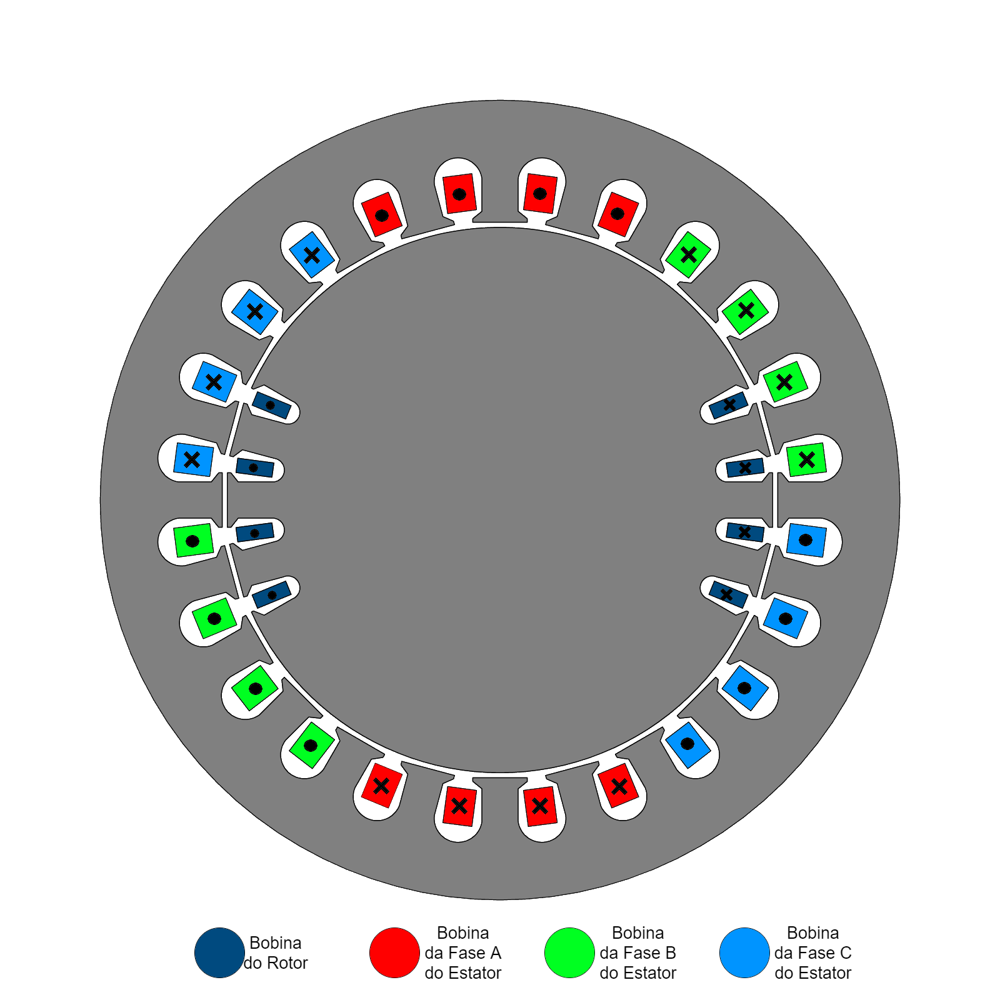
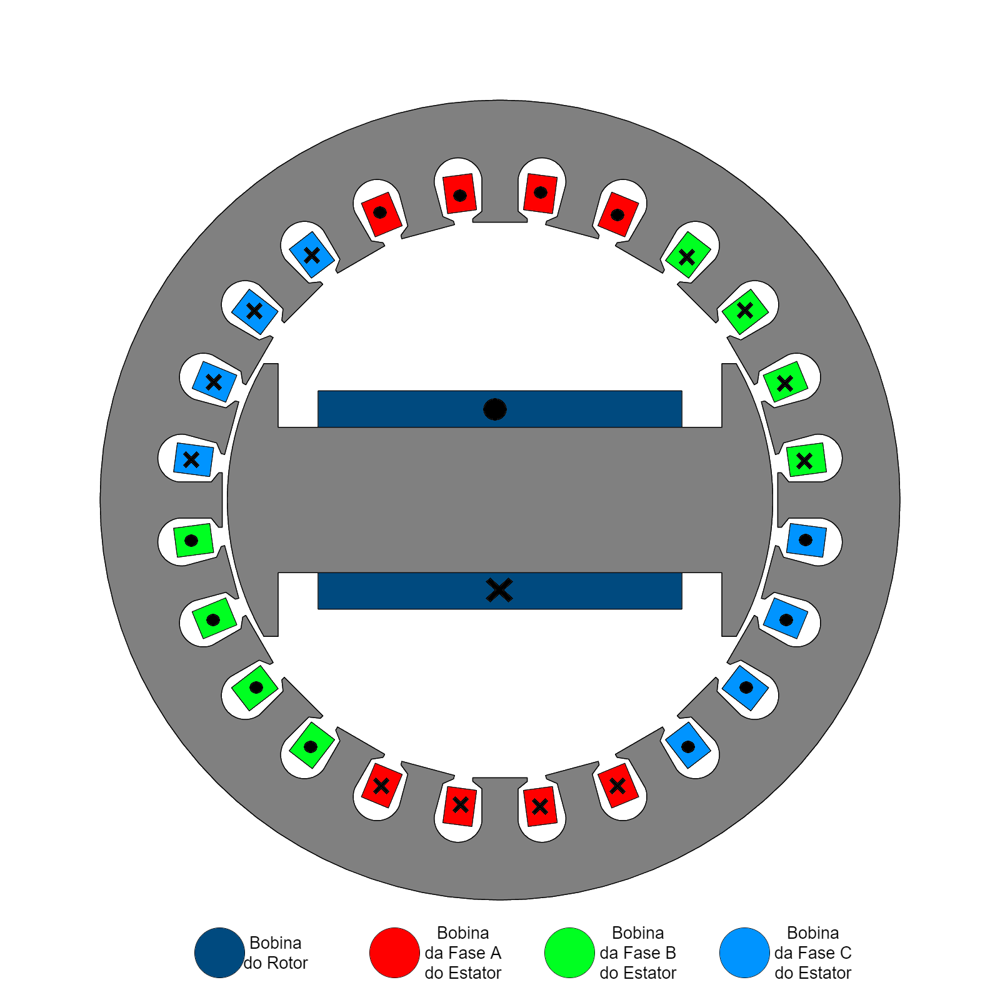

# Determinação de Indutâncias em Máquinas Rotativas

O objetivo desta aula de laboratório é determinar indutâncias próprias e mútuas de uma máquina rotativa conhecida como máquina síncrona. Esta é uma máquina de corrente alternada que será estuda, do ponto de vista elétrico, nas disciplinas de CEME II e Máquinas elétricas. O foco aqui será a parte magnética do problema. 

## Máquina considerada

A máquina considerada é uma máquina síncrona de dois polos. Esta máquina possui três conjuntos de bobinas no estator e um no rotor. O rotor, por sua vez, pode ser de polos lisos ou selientes como mostrado respectivamente nas figuras seguintes.

 
   

 
   

## Usando um Script *Lua* para movimentar o rotor da máquina e automatizar os testes

<!--

 

 >