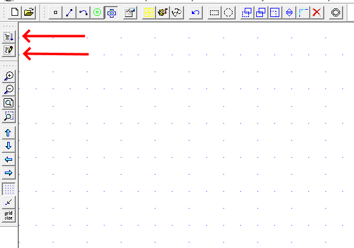

# Determinação de Indutâncias em Máquinas Rotativas

O objetivo desta aula de laboratório é determinar indutâncias próprias e mútuas de uma máquina rotativa conhecida como máquina síncrona. Esta é uma máquina de corrente alternada que será estuda, do ponto de vista elétrico, nas disciplinas de CEME II e Máquinas elétricas. O foco aqui será a parte magnética do problema. 

<h2> Máquina considerada</h2>

A máquina considerada é uma máquina síncrona de dois polos. Esta máquina possui três conjuntos de bobinas no estator e um no rotor. O rotor, por sua vez, pode ser de polos lisos ou salientes como mostrado respectivamente nas figuras seguintes. Observe, por exemplo, a fase A da primeira figura. Ela é composta por quatro bobinas e estas estão ligadas em série entre si. Ou seja, apenas uma circuito é associado a este grupo de bobinas. O mesmo é válido para os demais grupos de bobinas. Além disto, as bolinhas e as cruzes indicam onde a corrente sai e onde entra. Esta estratégia de disposição das bobinas, popularmente conhecida como *enrolamento distribuído*, é utilizada reduzir distorções harmônicas das tensões produzidas pela máquina. Maiores informações podem ser encontradas nos seguintes livros:

- Chapman, Fundamentos das Máquinas Elétricas. 5ed. Capítulo 3 e Apêndice B 
- Umans, Máquinas Elétricas de Fitzgerald e Kingsley. 7ed. Capítulo 4

 
   

 
   

Os arquivos <code>MaquinaRotativaTriFasica.FEMM</code> e <code>MaquinaRotativaTriFasicaSaliente.FEMM</code> foram criados para representar as duas máquinas das figuras anteriores.

<h2> Objetivo e Metodologia</h2>

Como mencionado, o objetivo é obter as indutâncias próprias e mútuas das duas máquinas para as diferentes posições dos seus rotores. A metodologia utilizada é similar ao do **Lab3**:

- Alimentar apenas uma bobina com corrente
- Medir os fluxos concatenados de todas as bobinas
- Girar o rotor e repetir o processo

O rotor deverá ser girado de 5 em 5 graus até 360º.

<h2> Automatização das Medidas</h2>

 O FEMM possibilita a utilização de scripts na linguagem [Lua](https://www.lua.org/portugues.html) para automação dos processos de desenho, simulação e processamento dos resultados. Os dois botões na figura seguinte são usados nesta tarefa. O inferior abre um terminal que permite inserir e executar comandos Lua. O superior, por outro lado, permite selecionar um script <code>.lua</code> inteiro para execução. 
 
 
 
 

 
   

 
O capítulo 3 do [manual do FEMM](http://www.femm.info/Archives/doc/manual.pdf) apresenta uma lista de funções internas que podem ser usadas na automação. Para o nosso caso, as de maior importância são
 
* <code>mi_selectcircle(x,y,R,editmode)</code>: Slecionar o que está dentro de um círculo de raio <code>R</code> centrado em <code>(x,y)</code>. <code>editmode</code> é um código que indica o que selecionar (4 para selecionar tudo).
* <code>mi_analyze()</code>: Realiza a análise.
* <code>mi_moverotate(bx,by,shiftangle (editaction))</code>: Aplica um giro no que está selecionado.
 
O arquivo <code>ScriptGiraRotorEComputaFluxo.lua</code> apresenta um script para realizar as medidas de fluxo concatenado para diferentes posições de rotor e salvas os resultados em um arquivos <code>.csv</code>. Este script foi configurados para esta máquina em específico, mas pode ser adaptado para outras.

Obsevação: O script não altera as correntes.

Observação 2: A [versão 4.0 da linguagem Lua](https://www.lua.org/manual/4.0/manual.html ), embora não seja a mais recente, é a suportada pelo FEMM.

<h2>Relatório</h2>

* Apresentas os gráficos das indutâncias em função da posição do rotor para as duas máquinas.
* Utilizar a metodologia de regressão usada no **Lab2** para determinar expressões para as indutâncias
* Comparar os resultados das uas máquinas

<h2>Demonstrativo</h2>

A figura seguinte tem uma pequena animação da máquina durante a operação. Para este case, bobina do rotor foi alimentada com 3A CC e as demais foram mantidas em aberto.
  
 
 

 
   
 
Observação: O rotor desta máquina é ligeiramente diferente do rotor da máquina de polos lisos que vocês utilizarão.
